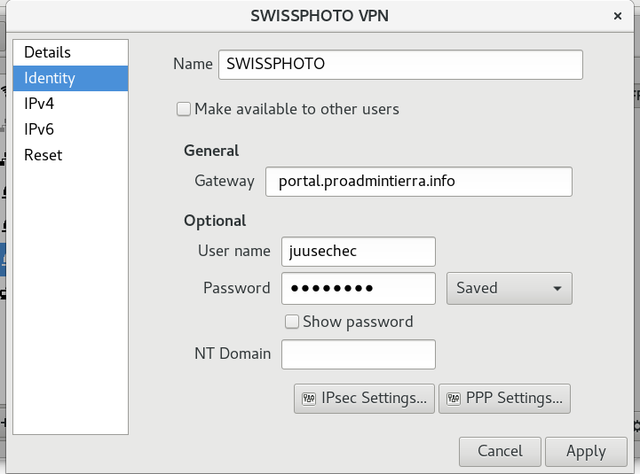
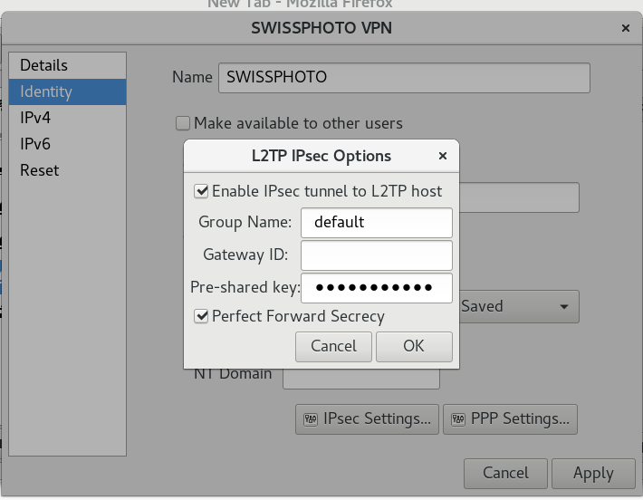
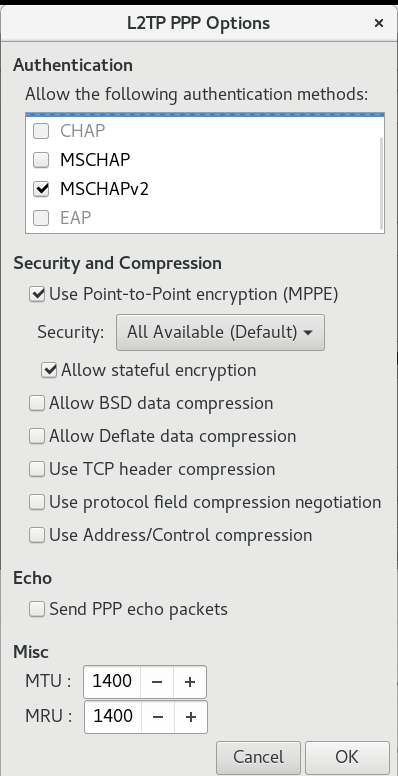
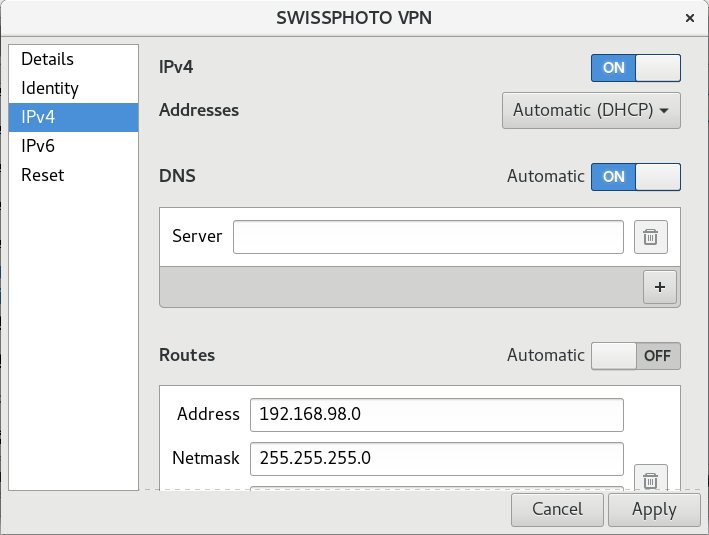
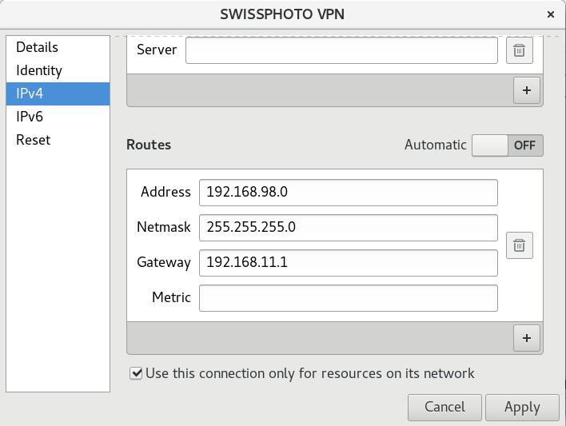

# Instalación en GNOME (Distribuciones basadas en Fedora, OpenSuse y Debian)

1) Se necesita instalar el paquete de conexión VPN L2TP para GNOME esto permite la conexión de VPN con interfaz gráfica GUI.

Debian:
bash
sudo apt install l2tp-ipsec-vpn-daemon

Basadas en Ubuntu 18.04 
bash
sudo apt install network-manager-l2tp
sudo apt install network-manager-l2tp-gnome

OpenSuse 42.2:

Descargar el paquete

1 Click Install
http://software.opensuse.org/ymp/home:iSipi/openSUSE_Leap_42.2/NetworkManager-l2tp.ymp?base=openSUSE%3ALeap%3A42.2&query=NetworkManager-l2tp

Rpm
http://download.opensuse.org/repositories/home:/iSipi/openSUSE_Leap_42.2/x86_64/NetworkManager-l2tp-1.0.4-8.1.x86_64.rpm

bash
sudo zypper install NetworkManager-l2tp-gnome

Fedora:
bash
sudo dnf install NetworkManager-l2tp-gnome

2) Seleccionar el tipo de conexión.
- Ir al panel de configuraciones de GNOME "Settings".
- En la categoría "Hardware" seleccionar "Network".
- Agregue una nueva conexión haciendo clic en el botón "+".
- En el diálogo "Add Network Connection" seleccione "VPN" y luego "Layer 2 Tunneling Protocol (L2TP)"

3) Configurar la conexión.

Utilice los siguientes datos de conexión.

Name: SWISSPHOTO
Gateway: portal.proadmintierra.info
Username: su_nombre_de_usuario
Password: su_password
Group Name: default
Pre-shared key: pregunte_a_su_admin
Autentication methods: MSCHAPV2
Use Point to Point encription (MPPE) Security: 128 bit

Algunas imágenes del proceso.

## Conectar a la vpn sin perder el internet local.

En ambos sistemas debe estar desactivada la casilla de "Usar la puerta de enlace predeterminada en la red remota"

Windows
Abrir la consola de windows "Cmd" como administrador.

route ADD 192.168.98.0 MASK 255.255.255.0 192.168.11.1

Linux
bash
sudo ip route add 192.168.98.0/24 via 192.168.11.1 dev ppp0

Si usas gnome puedes hacer:

